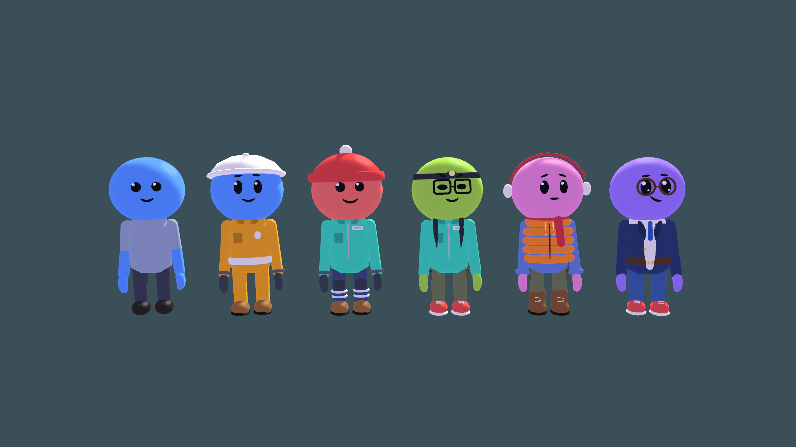
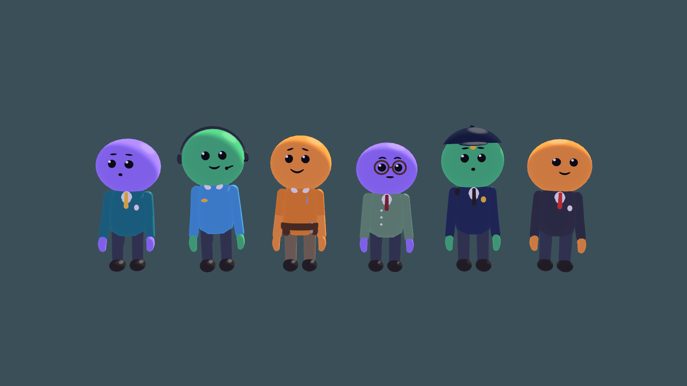
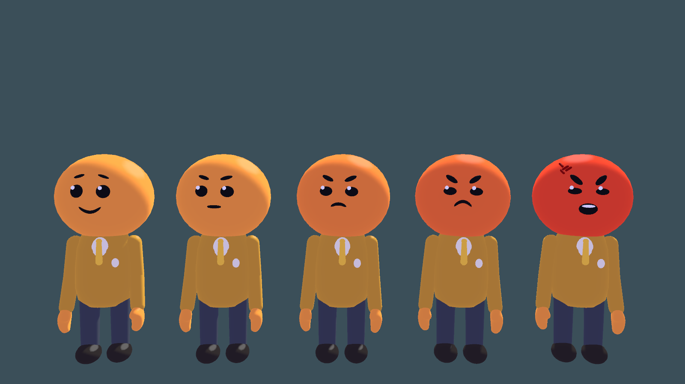

# The Elevator

**First floor — Morrow Systems:** choose **The Elevator > Play Updated Office**. New runs randomize the office layout. A bright access card is always on reception; recover the required asset to unlock floor 2 on the right-hand elevator panel. Read the physical notebook on the cabin table for controls. See [the elevator revision](Docs/Office/ELEVATOR-REVISION.md). Both launch scenes start in this office.

A standalone Unity 3D prototype about disposable maintenance workers exploring an impossible municipal facility from a freight elevator. Oversized boots, uneasy faces, bad paperwork, suspicious valuables.

**Current milestone:** playable procedural-map foundation. First-person by default; maps sized for a future four-player group. Networking remains undecided and **online co-op is not implemented**. Unity compilation, geometry checks and automated Play-mode integration have passed. Human playtesting and performance tuning remain.

## Open and play

1. In Unity Hub, open this **TheElevator** folder, containing Assets, Packages and ProjectSettings. Use Unity **6000.3.25f1** and the built-in rendering pipeline.
2. Choose **The Elevator > Play Updated Office** to start the original game.
3. Wait for generation, optionally open **Settings / Customize Avatar**, and click **Clock In**.
4. On the first floor, pick up the reception access card, open the secured room, and haul the required asset fully into the lift before selecting the newly unlocked number.

The world is assembled when Play starts. For an edit-mode map, open **The Elevator > Generation Lab**, choose a preset, click **Generate graph**, then **Build 3D preview**. The preview lives in a separate temporary scene and clears before Play.

## Current redesign

The original game now uses rounded office geometry, a soft color palette, full player-body rendering and shadows, and big-headed "bean" characters: painted faces, noodle arms, mitten hands. Existing office tasks, suspicion, keycards, cargo extraction and elevator progression are preserved. See [art-direction notes](Docs/ArtDirection/README.md).

### Avatar customization

Every player starts as a plain avatar: plain tee, plain trousers, plain shoes, bare hands. **Settings / Customize Avatar** (on the clock-in screen, or **Settings / Avatar** in the pause menu) changes skin color, head item, eyes, mouth, eyebrows, glasses, shirt, jacket, pants, shoes and gear, each with at least five choices, with a live preview. The look saves automatically between sessions. Every wardrobe item already carries a price for the planned lobby shop; nothing is locked yet. Items live in `Assets/Scripts/Characters/AvatarWardrobe.cs`; one sheet per category is in [Docs/ArtDirection/Wardrobe](Docs/ArtDirection/Wardrobe).

Office staff dress for their job: associate, receptionist (headset), technician (tool belt), records clerk (cardigan, glasses), security (cap, radio) and supervisor (red tie). Re-render every lineup and wardrobe sheet with **The Elevator > Render Character Cast**.

### Anger and the boardroom

There are no suspicion or incident meters. Every employee has their own anger. It starts at 1 and shows on their face up to 5: a resting face, then annoyed, irritated, angry, and finally red-faced and shouting. Offences add to it:

| What you do to them | Anger |
|---|---|
| Walk into them | +1 |
| Take an award or other item off their desk | at least 3, then +2 each time |
| Take their computer | at least 5, then +5 |
| Throw something at them (also 10 damage) | at least 5, then +5 |
| Spray them with extinguisher foam | at least 5, then +5 every 1.5 s of spraying |

Only the person you wronged gets upset; bystanders stay calm. Walking, running or sitting near people is fine. Keep walking into a standing employee and you shove them; afterwards they stop, glare at you and tell you off. At 5 they get up and come after you, yelling about what you did. Break line of sight for 10 seconds and they settle to 4, still on edge; anger never goes back to normal on its own. Three employees on every floor keep a weapon in their desk: two have an assault rifle, one a bazooka. Once one of them is furious, every further offence is a 2% chance (rifle) or 1% chance (bazooka) they pull it and hunt you for good. In their hands the rifle does 10 a round and misses most shots; a rocket's 10 m blast does up to 90 and hurts employees too. At 20 anyone snaps: they hunt you for good and shove and punch (5 damage). Walking into someone sitting in their chair counts as a bump too.

Knock out an armed employee and they drop their weapon. Pick it up and hold the left mouse button: in your hands every rifle round (30 in the magazine) and every rocket blast (3 rockets) is a one-hit knockout, for employees and players alike. The ring around the cursor shows the ammunition used.

You have 100 health; the lift is safe. Knocked out, you go ragdoll where you fall and spectate a teammate who is still standing, or, with nobody left, the shift ends. Each crew member is worth an equal share of the pay: a teammate can carry your body back to the lift (look at it and press E), and if the lift leaves without it, everything recovered is worth that share less (one body of four: 25%; one of three: 33%). Downed crew come to in the lift on the next floor. Employees have 200 health and go ragdoll when knocked out.

Chairs are solid, and so are people sitting or standing at work: you walk around them, not through them.

Most floors hide a boardroom: a dead-end room two rooms long with one door, a long table ringed by mostly occupied chairs, and a presenter at the far end pointing a stick at the quarterly chart. You may walk in and listen; nobody minds unless you bump into them.

### Office talk

Employees murmur a soft made-up language in their own voices: you hear gibberish, and a flat speech bubble above their head (always facing you) shows what they mean, one phrase at a time. Their voice follows their anger: calm at levels 1-2, tense and upset at 3-4, and yelling at 5, when the bubble turns red and the words get rude (never swearing). Each person says one line at a time: anything new waits until they finish, and bubbles of people standing close together stack instead of overlapping. What they say depends on what you did and how angry they are, with a large pool of lines for each. Two colleagues passing in a hallway either walk on or, half the time, stop for a proper chat about reports, printers, lunch plans and so on. In the boardroom the presenter's words appear above their head.

### Sitting

Every desk chair, boardroom chair, armchair and sofa cushion is a seat. Look at a free one and press E to sit; E, Space or any movement key stands you back up. Employees use the same sit-down animation: they squat into the seat leaning forward, then settle back with their hands on their lap. A seat you are sitting on is held for you; its usual occupant waits.

### Fire extinguishers

One room in four has a fire extinguisher hanging on a wall bracket. It is worth $10. Pick it up and the left hand carries the canister while the right hand aims the nozzle on its hose. Hold the left mouse button to spray white foam. Anyone in the stream is pushed back like a strong wind for as long as you keep spraying. Foam sticks to the people it hits; in the face it blinds them until they wipe it off (a player sees their view covered in foam for a few seconds). On the ground it melts away about 20 seconds after it lands. A full extinguisher sprays for 12 seconds in total; stopping early keeps the rest, and an empty one stops spraying. The ring around the cursor fills as you use it up.

To create the Windows game after cloning, open the project in Unity and choose **The Elevator > Build Windows Player**. Run `PLAY THE ELEVATOR.cmd` after the build completes. The executable is generated at `Builds/Windows/TheElevator.exe`. Build output, Unity caches and temporary validation results are intentionally excluded from Git; the source assets, scenes, packages, project settings, tests and tools needed to rebuild are included.

## Map sizes

| Preset | Rooms | Levels | Loops | Survey terminals | Departure timer |
|---|---:|---:|---:|---:|---:|
| Small (default) | 18 | 1 | 2 | 1 | 8 minutes |
| Standard | 72 | 2 | 8 | 3 | 25 minutes |
| Large | 120 | 2 | 14 | 4 | 30 minutes |
| Extreme | 192 | 3 | 20 | 5 | 40 minutes |

These are configurable targets, not measured session lengths. Standard is intended for 15–30 minutes of group exploration; actual four-player pacing needs testing. Profile assets live under Assets/Resources/Generation. Select the scene bootstrap to change **Map Scale**, a profile override, or a manual seed before Play.

## Your shift

Three stops share the original power, cargo and weight rules. Bring cargo all the way inside the elevator. The 180 kg limit includes your 70 kg worker; overload increases power consumption and door-closing time. The lift starts with 68 power and normal departure costs 24, so connect at least one cell during a complete shift.

Remote survey consoles provide distant exploration targets. Completion is tracked per floor; it currently neither gates departure nor awards an economy bonus. Records offices, wet utilities, sorting rooms, break areas, landmarks and stair galleries populate the facility. Custodians patrol deeper regions and knock you back if they catch you. The lift is safe; the timer can leave you behind.

Cargo recovered in the cabin persists between floors. Pause and loss of focus stop simulation. Disabling **Use Procedural Floors** retains the original three compact layouts and 110-second timers.

## Controls

| Input | Action |
|---|---|
| WASD / mouse | Move / look |
| Shift / Space | Sprint / jump |
| Ctrl or C | Crouch |
| E | Pick up, drop, sit/stand, or use survey terminal |
| Hold/release Q | Charge/release throw: a ring fills around the cursor, and a full ring is the hardest throw; tap gently drops; E cancels |
| Hold left mouse | Use the held item (spray an extinguisher); the same ring shows how much is used |
| F | Connect held power cell inside lift |
| E / left click on a floor number | Select an unlocked elevator floor |
| L | Flashlight |
| Escape | Pause |
| F3 | Developer generation panel: seed, size, replay, graph |
| V | Developer first/third-person toggle |

F3 regeneration requires returning to the cabin. An Inspector profile override takes precedence over the size selector. Seeds and surveys appear in the HUD. The graph is a developer tool, not a player minimap.

## Extend and verify

Read [the architecture and authoring guide](Docs/PROCEDURAL_GENERATION.md) for seed contracts, room dimensions, departments, prefab interiors, socket callbacks and future networking. [Verification details](VERIFICATION.md) distinguish automated checks from remaining playtests.

Run from PowerShell in this folder:

~~~powershell
.\Tools\Verify.ps1
.\Tools\VerifyGeneration.ps1
.\Tools\VerifyUnityGeneration.ps1
~~~

The last command copies source/settings into TestResults/GenerationValidation and runs a hidden Unity instance there. Your normal project can stay open. Results include logs, a manifest, a first-person render and a Play-mode result.

Use **The Elevator > Build Windows Player** to build Builds/Windows/TheElevator.exe; distribute the entire output folder. A standalone build has not been verified this milestone.

Current limits: primitive placeholder interiors, fixed 12 m room kit, graph-based enemy navigation, no transport, proximity voice, locked-door gameplay, event behaviors, progression save or destruction. Content sockets and semantic zones provide extension points. Physics and live AI are not deterministic network simulation.

